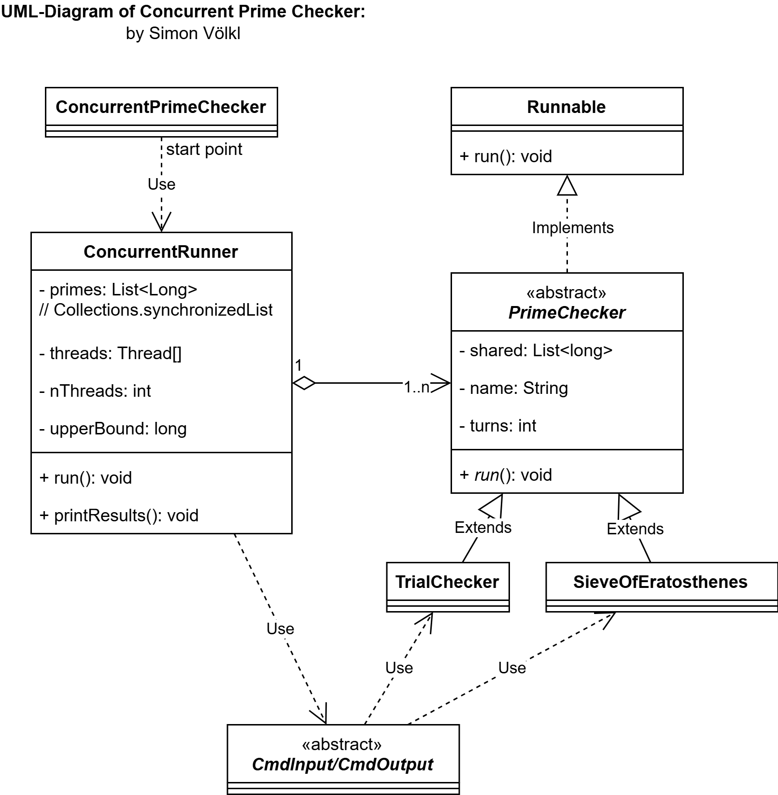

# Aufgabe 2: Concurrent Prime Checker

This project implements a concurrent prime number checker using multithreading. It supports two different prime-checking algorithms: Trial Division and the Sieve of Eratosthenes, both optimized for parallel execution with dynamic load balancing. Made by Simon Völkl in 2025.

## Requirements for the Build and Runtime Environment

This project was tested with the following configurations. I recommend using the same setup:

- OS: Linux (per SSH) with access by Windows_NT x64 10.0.26100.
- IDE: VS Code 1.107.0 (user setup).
- Encoding: UTF-8.
- Java JDK: JavaSE-11.
- Folder: Go into the project folder. You should see the folders _.vscode_, _src_, and this ReadMe.
- VS Code Settings: Ensure that the file _.vscode/settings.json_ has the parameter `java.project.sourcePaths": ["src/main/java", "src/test/java"]` with the source code locations set. You may also change the parameter `java.project.referencedLibraries` to fit your folder structure.
- Start the project by clicking the run button. The prime checker benchmarks should start automatically.

## Documentation

### General Task

#### Bottleneck of the TrialChecker

Suspicious results were found when running the TrialChecker for an upper bound of 1,000,000, as 4 threads were still faster than 12 or 24 threads. As an improvement, the following changes were applied to the `TrialChecker.run()` method:

**Problem:**
The initial size of the `ArrayList` was fixed and not dynamically adjusted, requiring frequent reinitialization.

**Before:**

```java
List<Long> localList = new ArrayList<>(1024);
```

**After**

```java
// blockSize is 20_000L per default.
List<Long> localList = new ArrayList<>((int) blockSize);
```

**Result:**
The initialization size is now dynamic and better aligned with the block size, reducing overhead and improving efficiency.

**Performance Observation:**
With a block size of 20,000, the negative impact of larger thread counts becomes evident, as initialization can take up to 0.5 ms per thread.

Test results for an **upper bound of 100,000** for the prime number search. Notice the slight increase in execution time due to the time intensive initialization phase of the threads at 24 threads in comparison to the lower execution time at 4 threads. The optimal thread count would be 5, as `100,000 / 20,000 = 5`.

| Threads | Execution Time (ms) |
| :------ | :-----------------: |
| 1       |          9          |
| 4       |          3          |
| 12      |          2          |
| 24      |          3          |

Test results for an **upper bound of 10,000,000** for the prime number search.
For larger ranges (up to 10 million), multithreading significantly reduces execution time; down to ~9% of the original single-threaded duration.

| Threads | Execution Time (ms) |
| :------ | :-----------------: |
| 1       |        2,616        |
| 4       |         690         |
| 12      |         240         |
| 24      |         233         |

### Extension

The extension implements the **Segmented Sieve of Eratosthenes** algorithm for significantly faster prime number computation, especially for large ranges.

#### Key Features:

1. **Segmented Sieve Implementation**: Instead of using trial division for each number, the Sieve of Eratosthenes algorithm marks all multiples of base primes up to √n to identify composite numbers efficiently.

2. **Two-Phase Approach**:

   - **Phase 1**: Compute base primes up to √(upperBound) using a regular sieve
   - **Phase 2**: Workers process segments in parallel, marking multiples of base primes

3. **Dynamic Block Allocation**: Both algorithms use an `AtomicLong` counter (`nextStart`) to dynamically allocate work blocks to threads, ensuring optimal load balancing without thread starvation.

4. **Performance Optimization**:
   - Block size automatically adjusts to `max(10,000, √n)` but capped at `Integer.MAX_VALUE`
   - Local buffers minimize thread synchronization overhead
   - Results synchronized only once per block rather than per prime found

#### Performance Comparison:

With an upper bound of 100.000:

- Trial Checker Single-Threaded: 8ms
- Trial Checker Mutli-Threaded (24 threads): 2ms
- Sieve of Eratosthenes Single-Threaded: 4ms
- Sieve of Eratosthenes Multi-Threaded (24 threads): 5ms

With an upper bound of 100.000.000:

- Trial Checker Single-Threaded: 68.965ms
- Trial Checker Mutli-Threaded (24 threads): 6204ms
- Sieve of Eratosthenes Single-Threaded: 460ms (!!!)
- Sieve of Eratosthenes Multi-Threaded (24 threads): 103ms (!!!)

As it can be seen, the Sieve algorithm's efficiency increases dramatically with larger number ranges and greatly outperforms the TrialChecker.

### Object Oriented Programming



- **`ConcurrentPrimeChecker`**: Main entry point that orchestrates benchmark runs for both algorithms with various thread counts and upper bounds.

- **`ConcurrentRunner`**: Manages parallel execution, thread coordination, and result collection. Handles both interactive mode (user input) and batch mode (predefined parameters).

- **`PrimeChecker`** (abstract): Base class for prime-checking implementations, providing common infrastructure for thread-safe result collection and dynamic block allocation.

- **`TrialChecker`**: Implements trial division algorithm. Each thread processes number blocks by testing divisibility up to √n.

- **`SieveOfEratosthenes`**: Implements segmented sieve algorithm. Uses precomputed base primes to efficiently mark composites in parallel segments.

- **`CmdInput`**: Handles user input validation for thread count, upper bound, and algorithm selection.

- **`CmdOutput`**: Formats and displays results including prime lists (full or reduced view) and computation statistics.

**Design Patterns Used:**

1. **Abstract PrimeChecker**: The `PrimeChecker` abstract class defines the algorithm interface, while `TrialChecker` and `SieveOfEratosthenes` provide different implementations. `ConcurrentRunner` can work with either strategy.

2. **Template Method Pattern**: `PrimeChecker` provides the common structure for all prime-checking algorithms, with subclasses implementing the specific `run()` method.

3. **Factory Pattern (implicit)**: `ConcurrentRunner` creates appropriate worker threads based on the `useSieveOfEratosthenes` flag, encapsulating the instantiation logic.

4. **Thread-Safe Collections**: Uses `Collections.synchronizedList` for thread-safe result storage, ensuring safe concurrent access without explicit locking in most cases.

5. **Atomic Variables**: Uses `AtomicLong` for lock-free thread coordination and dynamic work distribution, eliminating contention bottlenecks.

**Testing Coverage:**

The project includes comprehensive unit tests with approximately **61%** code coverage.

The modular design allows for easy testing, maintenance, and future extensions of the program logic.

## Sources

1. For generating Java Docstrings and the ReadMe documentation, the VSCode Extension "GitHub Copilot Chat" with the Model "Claude Sonnet 4.5" was used. All outputs were reviewed and edited if needed.
2. [SynchronizedList](https://zetcode.com/java/collections-synchronizedlist/)
3. [CopyOnWriteArrayList](https://www.geeksforgeeks.org/java/copyonwritearraylist-in-java/)
4. [Oracle synchronizedList](https://docs.oracle.com/javase/8/docs/api/java/util/Collections.html)
5. [Final keyword](https://javabeginners.de/Grundlagen/Modifikatoren/final.php)
6. [List > sublist](https://www.w3schools.com/java/ref_arraylist_sublist.asp)
7. [List Comparator](https://docs.oracle.com/en/java/javase/11/docs/api/java.base/java/util/List.html)
8. [Long compare](https://docs.oracle.com/javase/8/docs/api/java/lang/Long.html)
9. [JDK TimSort source code](https://github.com/openjdk/jdk/blob/master/src/java.base/share/classes/java/util/TimSort.java)
10. [TimSort for objects](https://stackoverflow.com/questions/4018332/is-java-7-using-tim-sort-for-the-method-arrays-sort)
11. [Duplicate removal with streams](https://www.javaspring.net/blog/remove-duplicate-in-list-java/)
12. [Stream distinct hashing](https://www.javaspring.net/blog/remove-duplicate-in-list-java/)
13. [Prime Checking Algorithms Benchmarked](https://labex.io/tutorials/python-how-to-optimize-prime-checking-algorithm-418862)
14. [Oracle AtomicLong](https://docs.oracle.com/javase/8/docs/api/java/util/concurrent/atomic/AtomicLong.html)
15. [Using Atomic Variables](https://www.geeksforgeeks.org/java/atomic-variables-in-java-with-examples/)
16. [Sieve of Eratosthenes 1](https://www.geeksforgeeks.org/dsa/sieve-of-eratosthenes/)
17. [Sieve of Eratosthenes 2](https://cp-algorithms.com/algebra/sieve-of-eratosthenes.html)
18. [Sieve of Eratosthenes 3](https://en.wikipedia.org/wiki/Sieve_of_Eratosthenes#Segmented_sieve)
19. [Using Atomic Long](https://zetcode.com/java/atomiclong/)
